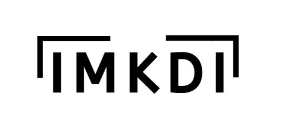
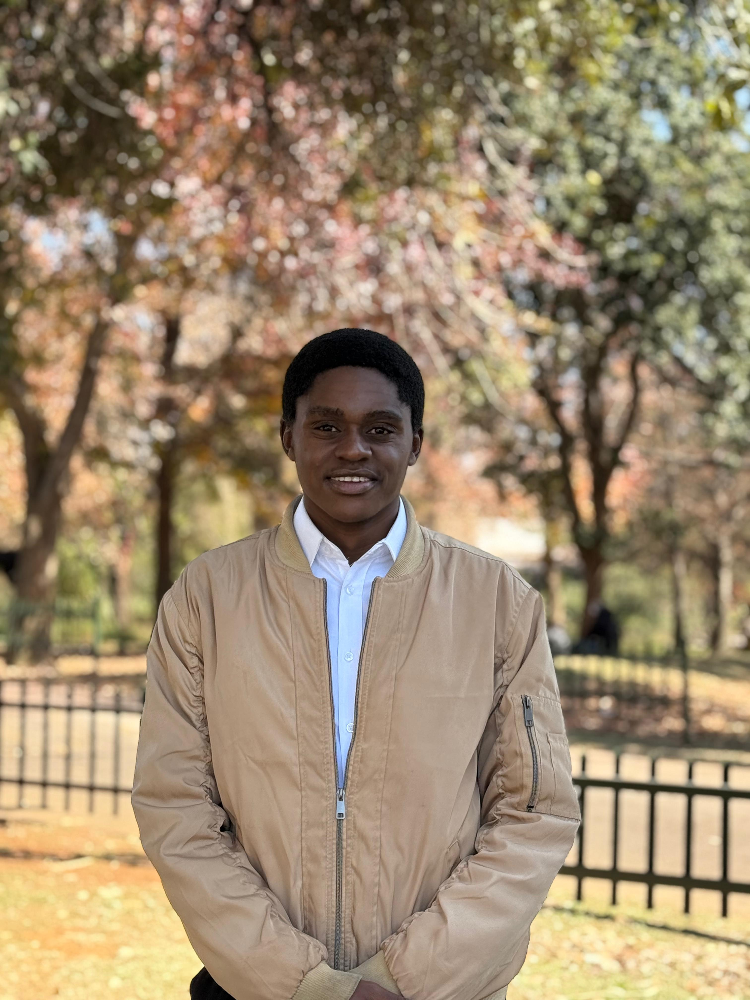
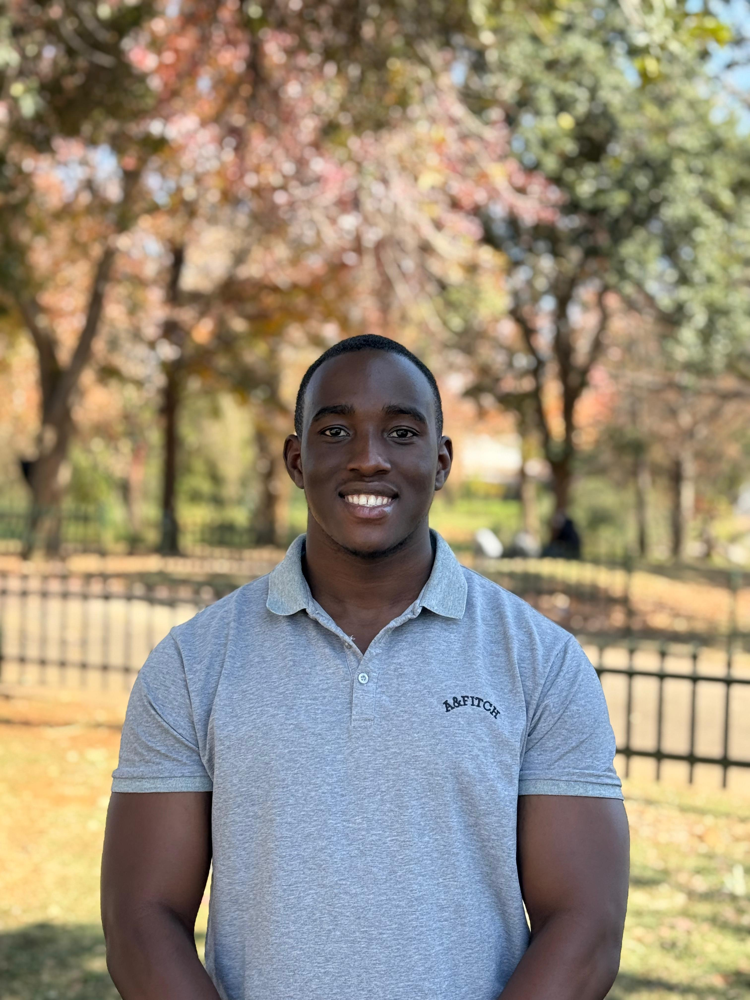

  
  

  
<h1 align="center">Hands UP by TMKDT</h1>

## Project Description 

Hands UP is an innovative application that bridges the communication gap between signers and non-signers. Using advanced AI technology, the application detects and translates sign language in real-time through the device's camera, converting signs into both text and spoken language without significant delays. Beyond translation, it also serves as an interactive learning platform with structured lessons and immediate feedback on signing accuracy.

Thus, the system focuses on three core functionalities: 
1. Real-time sign language translation
2. Interactive learning with AI-powered feedback 
3. Progress tracking for users

 

<h2 >Demo Videos</h2>
| Demo # | Video Link                                                                 |
|--------|----------------------------------------------------------------------------|
| 1      | [Video](https://drive.google.com/file/d/1mFRqv6zRN1a6LuKWWXX5wu1XCvTVVWZ7/view) |

 

<h2 >Links to SRS Document and SubParts</h2>

| Resource                          | Description                             |
|-----------------------------------|-----------------------------------------|
| [SRS Document](https://github.com/COS301-SE-2025/Hands-Up/wiki/SRS)                | Outlines the system's functional and non-functional requirements |
| [Domain Model](https://github.com/COS301-SE-2025/Hands-Up/wiki/SRS#domain-model)                | Visual representation of key entities and their relationships |
| [Use Case Diagram](https://github.com/COS301-SE-2025/Hands-Up/wiki/SRS#use-case-diagram)           | Overview of system interactions with external actors          |
| [Functional Requirements](https://github.com/COS301-SE-2025/Hands-Up/wiki/SRS#functional-requirements)    | Core functionalities the system must perform                  |
| [Architectural Requirements](https://github.com/COS301-SE-2025/Hands-Up/wiki/SRS#architectural-requirements) | High-level design constraints and objectives                  |
| [Architectural Patterns](https://github.com/COS301-SE-2025/Hands-Up/wiki/SRS#architectural-patterns)      | Chosen architectural solutions and justifications             |
| [Design Patterns](https://github.com/COS301-SE-2025/Hands-Up/wiki/SRS#design-patterns)            | Reusable solutions to common software design problems         |
| [Constraints](https://github.com/COS301-SE-2025/Hands-Up/wiki/SRS#constraints)                | Technical, business, or environmental limitations             |
| [Service Contracts](https://docs.google.com/document/d/14V-21fzAjwRsA2nPEop3hE1Vkl4h4Zx2k93k3Eh4bT0/edit?tab=t.0#bookmark=id.iixpcq5t2vzu)         | Defined inputs, outputs, and behaviors of services            |
| [Technology Requirements](https://github.com/COS301-SE-2025/Hands-Up/wiki/SRS#technology-requirements)   | Platforms, tools, and languages required for implementation   |

<h2 align="center">Badges </h2>
 

<!-- 🐛 Issues -->

 <h2 align="center">Technologies </h2>
 

Artificial Intelligence & Machine Learning

 
Frontend

  
  
Backend

    

Project Management & Deployment

   

Testing

    
    

  

   
<h1 align="center">Meet The Team</h1>

<table border="0" cellpadding="15" cellspacing="0" style="width: 100%;">
 <tr>
    <td style="vertical-align: top; width: 70%; border: 0; padding: 15px;">
      <h2><b style="font-size: 18px;"> Karabo Serothoane</b></h2>
      <h3><b style="font-size: 16px;">Leader, Tester </b></h3> 
      I have strong expertise in API design and system integration, with hands-on experience in Azure development and Node.js. I am skilled in crafting efficient RESTful APIs using OpenAPI specifications and take a detail-oriented approach to both development and quality assurance to ensure seamless communication within systems. 
        
      In addition, my familiarity with Docker allows me to adapt applications across diverse deployment environments with ease. Over the past few years, I have gained valuable experience in group dynamics and leadership, further strengthened by my participation in a GirlCode Hackathon and vacation work with BBD. These opportunities helped me refine my collaborative skills, apply my technical knowledge in real-world scenarios and contribute meaningfully in team-driven environments.
        
      
      
    </td>
    <td style="vertical-align: top; width: 30%; border: 0; padding: 15px; text-align: center;">
      
    </td>
  </tr>
</table>

<table border="0" cellpadding="15" cellspacing="0" style="width: 100%;">
  <tr>
    <td style="vertical-align: top; width: 70%; border: 0; padding: 15px;">
      <h2><b style="font-size: 18px;">Thendo Mbedzi</b></h2>
      <h3><b style="font-size: 16px;">Co-leader, UI/UX </b></h3> 
      I am a final-year BSc Computer Science student with a strong foundation in frontend development, database design, and programming. My academic projects have allowed me to develop hands-on experience in UI/UX design, web development, and database systems, including designing a movie website and NoSQL database interface. 
        
      I am skilled in collaborative development, using Git for version control and Visual Paradigm for system design and modeling. My teamwork approach balances task delegation with active collaboration, ensuring clear communication and progress tracking. I am currently expanding my expertise through studying computer graphics, which enhances my ability to integrate modern visual elements into software projects.
        
      
      
    </td>
    <td style="vertical-align: top; width: 30%; border: 0; padding: 15px; text-align: center;">
      
    </td>
  </tr>
</table>

<table border="0" cellpadding="15" cellspacing="0" style="width: 100%;">
 <tr>
    <td style="vertical-align: top; width: 70%; border: 0; padding: 15px;">
      <h2><b style="font-size: 18px;">Tambi Chirima</b></h2>
      <h3><b style="font-size: 16px;">DevOps Engineer</b></h3> 
      I work well in a professional team environment bringing over three years of part time experience across diverse roles. My most notable positions include working as a manager for a food vendor (currently), an administrative secretary for a small software development firm and as an IT tutor for matric students. My passion lies with backend development, network operations and cloud engineering.
        
      
      
    </td>
    <td style="vertical-align: top; width: 30%; border: 0; padding: 15px; text-align: center;">
      
    </td>
  </tr>
</table>

<table border="0" cellpadding="15" cellspacing="0" style="width: 100%;">
 <tr>
    <td style="vertical-align: top; width: 70%; border: 0; padding: 15px;">
      <h2><b style="font-size: 18px;">Driya Govender</b></h2>
      <h3><b style="font-size: 16px;">Business Analyst, Secretary</b></h3> 
      As a Computer Science student, I enjoy exploring how technology can create smart, efficient solutions. I am especially drawn to data science and the Internet of Things (IoT). 
        
      While most of my experience lies in front-end development, I have also gained experience in backend development through previous projects involving RESTful APIs, managing relational databases and implementing secure authentication systems. In addition to my technical skills, I am highly organized, manage my time effectively, and thrive in dynamic environments due to my adaptability and critical analysis skills.
        
      
      
    </td>
    <td style="vertical-align: top; width: 30%; border: 0; padding: 15px; text-align: center;">
      
    </td>
  </tr>
</table>

<table border="0" cellpadding="15" cellspacing="0" style="width: 100%;">
 <tr>
    <td style="vertical-align: top; width: 70%; border: 0; padding: 15px;">
      <h2><b style="font-size: 18px;">Mutarisi Chibaya</b></h2>
      <h3><b style="font-size: 16px;">Software Architect</b></h3> 
      I combine strong technical skills in full-stack development with passion for building innovative solutions to real-world problems. My experience spans system design, database architecture and application development with a proven ability to adapt quickly to new technologies and frameworks. My academic projects have honed my ability to deliver solutions under constraints, making me a valuable contributor to projects requiring both technical rigor and creative thinking.
        
      
      
    </td>
    <td style="vertical-align: top; width: 30%; border: 0; padding: 15px; text-align: center;">
      
    </td>
  </tr>
</table>

<h1 align="center">Contributions</h1>

<h2>Karabo Serothoane</h2>

  <ul style="margin-left: 0;">
    <li>Set up database on Docker</li>
    <li>Set up GitHub Actions</li>
    <li>Set up testing environment</li>
    <li>Implemented learning progress use case and testing</li>
  </ul>

<h2>Thendo Mbedzi</h2>

  <ul style="margin-left: 0;">
    <li>Designed and implemented all pages for UI</li>
    <li>Created and applied the app theme</li>
    <li>Created wireframes and mockups for documentation</li>
  </ul>

<h2>Tambi Chirima</h2>

  <ul style="margin-left: 0;">
    <li>Set up GitHub organisation and management</li>
    <li>Initialised GitHub structure (mono-repo)</li>
    <li>Implemented visual input use case and testing</li>
  </ul>

<h2>Driya Govender</h2>

  <ul style="margin-left: 0;">
    <li>Set up GitHub Wiki</li>
    <li>Implemented update user details use case and testing</li>
  </ul>

<h2>Mutarisi Chibaya</h2>

  <ul style="margin-left: 0;">
    <li>Designed the architecture of the system</li>
    <li>Developed and tested backend endpoints for login and sign up</li>
  </ul>

<h2>All team members contributed towards documentation</h2>
